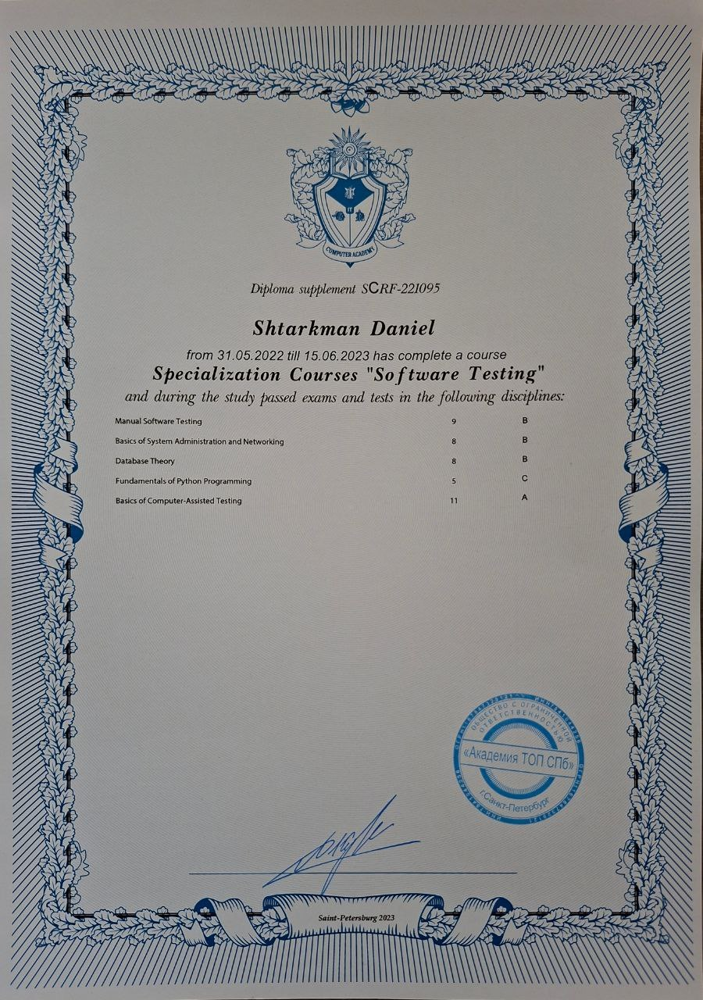
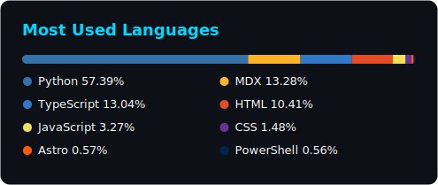

&nbsp;&nbsp;

⬆️ Click to switch language / Нажмите для смены языка

---

## About Me

Fullstack Developer, DevOps Engineer, and System Administrator with **4 years** of hands-on programming experience. I build and maintain full-cycle software solutions — from interactive frontends and robust backend services to containerized deployments and server infrastructure. Equally proficient on **Windows** and **Linux**, I operate at every layer of the stack: writing production-grade code, automating CI/CD pipelines, managing databases, configuring web servers, and administering VPS environments.

| Role                      | Focus                                                                 |
| :------------------------ | :-------------------------------------------------------------------- |
| **Web Developer**         | React, Next.js, TypeScript — responsive SPA/SSR applications          |
| **Backend Engineer**      | Python (Django, FastAPI, Flask), Node.js — REST & GraphQL API design  |
| **DevOps Engineer**       | Docker, CI/CD (GitHub Actions, GitLab CI), Nginx, SSL/TLS, monitoring |
| **Python Developer**      | Automation, bots, data processing, scripting, async frameworks        |
| **Desktop App Developer** | Tauri, Electron.js — cross-platform native applications               |

---

## Personal Strengths

|                            |                                                                                                                    |
| :------------------------- | :----------------------------------------------------------------------------------------------------------------- |
| **Driven by complexity**   | I seek out technically challenging tasks that push my limits and deepen my understanding of systems at every level |
| **Long-term commitment**   | I approach my career with a long-term perspective, investing in mastery rather than shortcuts                      |
| **Responsibility**         | I take full ownership of the work I deliver, from initial implementation through production stability              |
| **Individual growth**      | I follow a deliberate, self-directed development path, continuously expanding my skill set across new domains      |
| **Continuous improvement** | Consistently motivated to write better code, learn harder concepts, and take on greater engineering responsibility |

---

## Technical Stack

<b>Frontend</b>

- ES6+, async/await, TypeScript strict mode, React Hooks, Context API, Redux
- Next.js SSR/SSG, App Router, API Routes, Middleware
- Responsive design, Mobile-First, Flexbox/Grid, CSS animations
- Webpack, Vite, bundle optimization

<b>Backend</b>

- Django REST Framework, FastAPI async endpoints, Flask microservices
- PostgreSQL, MySQL, SQLite — schema design, migrations, query optimization
- JWT, OAuth 2.0, session-based auth, RBAC
- WebSocket, real-time communication, Telegram Bot API, third-party integrations

<b>DevOps & System Administration</b>

- Docker: Dockerfile, docker-compose, multi-stage builds, image optimization
- CI/CD: GitHub Actions, GitLab CI — automated testing, build, deploy pipelines
- Nginx: reverse proxy, SSL/TLS (Let's Encrypt), static file serving, load balancing
- Git: branching strategies, merge/rebase, GitFlow, code review

<b>Desktop & Cross-Platform</b>

- Tauri: lightweight, high-performance cross-platform desktop applications
- Electron.js: desktop applications for Windows, macOS, Linux
- React Native + Expo: mobile applications for iOS and Android

<b>Testing & QA</b>

- E2E testing with Playwright, UI automation
- Unit and integration tests with Jest and Pytest
- API testing (Postman), load testing, coverage analysis

---

## Projects

<table>
<tr>
<td width="50%" valign="top">

### Real-time Telegram Data Extraction Bot
**`Python`** **`Telethon`** **`aiogram`** **`asyncio`**

Built a Telegram bot that connects to channels and chats, extracts structured data in real time, and processes it for further analysis. Implemented asynchronous message handling, filtering logic, and persistent storage for extracted records.

</td>
<td width="50%" valign="top">

### Online Media Player
**`React`** **`TypeScript`** **`Web Audio API`**

Developed a feature-rich online media player with playlist management, equalizer controls, streaming support, and responsive UI. Designed for smooth playback and cross-browser compatibility with an intuitive interface.

</td>
</tr>
<tr>
<td width="50%" valign="top">

### Real-time Data Monitoring Dashboard
**`FastAPI`** **`PostgreSQL`** **`Docker`** **`WebSocket`**

Created a monitoring dashboard that ingests live data streams, stores metrics in PostgreSQL, and renders real-time charts and status indicators. Containerized with Docker for consistent deployment. Implemented WebSocket-based live updates.

</td>
<td width="50%" valign="top">

### Cross-Platform Fast File Manager
**`Tauri`** **`JavaScript`** **`Rust`**

Developed a lightweight, high-performance desktop file manager using Tauri. Features include fast directory traversal, file operations, multi-tab navigation, and keyboard-driven workflow. Runs natively on Windows, macOS, and Linux with minimal resource footprint.

</td>
</tr>
</table>

---

## Education

| Institution               | Specialization             | Period                 |
| :------------------------ | :------------------------- | :--------------------- |
| **Hexlet IT College**     | Web Development            | 2023 — 2026 (expected) |
| **Computer Academy STEP** | Software Testing (diploma) | 2021 — 2023            |

> Actively programming for **6 years**. Graduated as a certified **Software Tester** in 2023. Currently completing a **Web Development** program at Hexlet IT College, expected graduation in 2026.

<b>📜 Software Testing Diploma — click to view</b>

 

  
Computer Academy STEP — Software Testing, 2023

---

## GitHub Statistics

<!-- Self-generated stat cards (committed by the Metrics workflow — no rate limits) -->

  

<picture>
  <source media="(prefers-color-scheme: dark)" srcset="output/github-snake-dark.svg" />
  <source media="(prefers-color-scheme: light)" srcset="output/github-snake.svg" />
  
</picture>

---

## Let's Connect

Open to collaboration and new opportunities — feel free to reach out!

